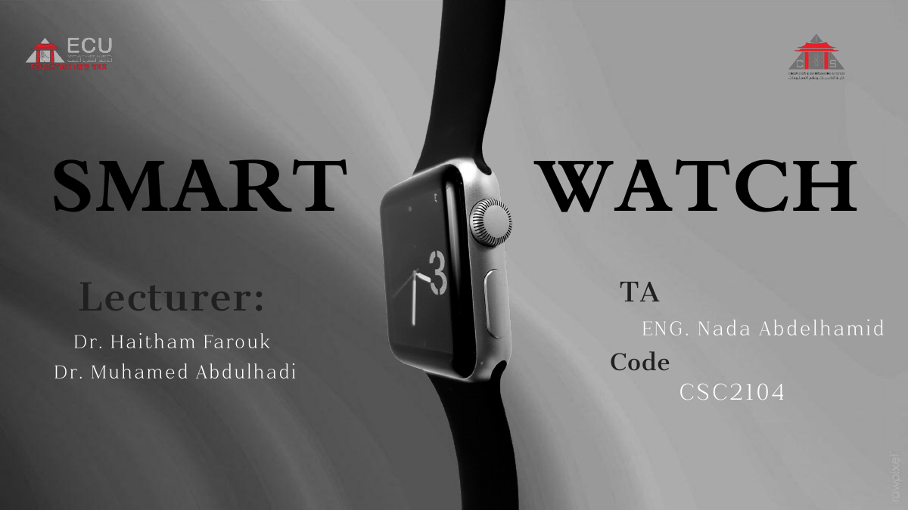
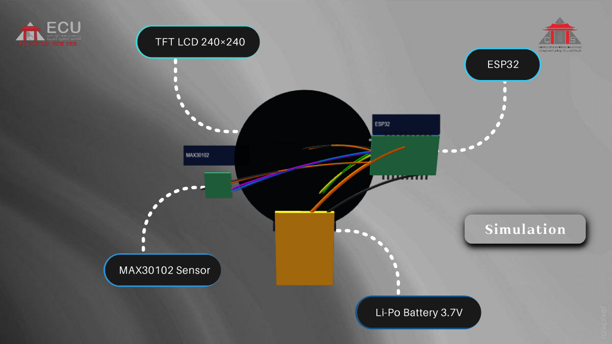

# Smart Watch — ESP32 Health Tracker

A low-cost smart watch prototype built on the ESP32 that tracks **heart rate (BPM)**, **SpO₂**, and **steps**, with a three-screen UI on a 240×240 TFT display.

**Course:** CSC2104
**University:** Egyptian Chinese University (ECU) — Faculty of Computer & Information Systems
**Lecturers:** Dr. Haitham Farouk, Dr. Muhamed Abdulhadi
**TA:** Eng. Nada Abdelhamid



## Idea
Premium smart watches cost roughly 10,000–20,000 EGP. This project targets essential health monitoring (heart rate and steps) with affordable components, aiming at a projected price of about 4,500 EGP.

## Features
- **Heart rate:** processes the raw IR signal from the MAX30102, detects beats, and averages them (moving average).
- **SpO₂:** ratio-of-ratios method with AC/DC component filtering.
- **Pedometer:** step detection from the MPU6050 with debounce and periodic auto-calibration.
- **Software RTC:** HH:MM:SS clock without an external RTC module.
- **UI:** three screens (Heart Rate, Activity, SpO₂) switched with a single button, using partial redraws to avoid flicker.
- **Startup self-check:** I²C scan to verify the sensors are connected.

## Hardware
| Part | Notes |
|---|---|
| ESP32 dev board | main controller |
| MAX30102 | heart rate / SpO₂ (I²C) |
| MPU6050 | motion / steps (I²C) |
| 240×240 TFT (ST7789) | SPI display |
| Li-Po battery 3.7 V | power |

## Pin mapping (from the firmware)
| Function | ESP32 pin |
|---|---|
| I²C SDA / SCL (MAX30102 + MPU6050) | GPIO 21 / 22 |
| TFT CS | GPIO 5 |
| TFT DC | GPIO 2 |
| TFT RST | GPIO 4 |
| TFT backlight | GPIO 12 |
| TFT MOSI / SCLK | GPIO 23 / 18 (default hardware SPI) |
| Screen-switch button | GPIO 0 (BOOT button) |

Sensors and display run on 3.3 V.

## Libraries
Install from the Arduino Library Manager:
- Adafruit GFX Library
- Adafruit ST7789 Library
- Adafruit MPU6050
- Adafruit Unified Sensor
- SparkFun MAX3010x Pulse and Proximity Sensor Library (provides `MAX30105.h`)

## Build & upload
1. Install the ESP32 board package in the Arduino IDE.
2. Open `firmware/smart_watch/smart_watch.ino`.
3. Select your ESP32 board and port, then upload.
4. Serial Monitor: 115200 baud.
5. Press the BOOT button to cycle between Heart Rate → Activity → SpO₂.

## Simulation / 3D visualization
`web/component-visualization.html` is a standalone page (three.js, loaded from a CDN) showing the components in 3D. Open it in a browser with internet access.



## Docs
Project presentation: [`docs/Smart-Watch-presentation.pdf`](docs/Smart-Watch-presentation.pdf)

## Future work
- Waterproof casing (IP68)
- Mobile app over Bluetooth Low Energy for syncing and long-term health trends

# ⌚ Health Monitor Pro
### ESP32 Smart Health & Activity Monitor

**Health Monitor Pro** is an ESP32-based smart monitoring system that combines a color TFT display with biometric and motion sensors to provide real-time measurements of **Heart Rate, SpO₂, Steps, Movement, and Time**.

The system uses a **MAX30102** optical sensor for heart-rate and SpO₂ measurements and an **MPU6050** motion sensor for activity and step detection. A **172×320 ST7789 TFT display** provides a compact smartwatch-style interface.

> ⚠️ **Disclaimer:** This project is intended for educational and prototyping purposes only. The displayed health measurements should not be used for medical diagnosis or treatment.

---

## ✨ Features

- ❤️ Real-time **Heart Rate (BPM)** monitoring
- 🫁 **SpO₂** estimation using the MAX30102
- 👣 **Step Counter**
- 🏃 **Movement Detection**
- 📈 Accelerometer-based activity analysis
- 🕐 Digital **Real-Time Clock display**
- 📱 3 interactive display screens
- 🔘 Screen switching using the ESP32 **BOOT button**
- 🔌 I²C device scanning and automatic sensor detection
- 🎛️ Adjustable MPU6050 sensitivity
- 💻 Serial Monitor control commands
- 🔄 Complete system reset functionality
- 🎨 Professional dark TFT interface
- ⚡ Real-time sensor updates with optimized update intervals

---

## 🖥️ Display Screens

The project contains three main screens:

### 1. Heart Rate Screen ❤️

Displays:

- Average Heart Rate
- Finger detection status
- Current time
- Sensor connection status

The system processes the IR signal from the MAX30102 and detects heartbeats based on changes in the optical signal.

---

### 2. Activity Screen 👣

Displays:

- Step count
- Movement status
- Accelerometer-based activity information
- MPU6050 sensitivity
- Current time

The MPU6050 accelerometer is used to analyze movement and detect steps.

---

### 3. SpO₂ Screen 🫁

Displays:

- Estimated oxygen saturation
- Finger detection status
- Current time
- Sensor status

The SpO₂ value is calculated using the red and infrared signals from the MAX30102.

The interface uses different colors depending on the displayed value:

- 🟢 **95–100%** → Normal display state
- 🟡 **90–94%** → Warning state
- 🔴 **Below 90%** → Low-value state

> These ranges are implemented as display indicators in the project and are not intended as medical interpretation.

---

## 🧩 Hardware Components

| Component | Purpose |
|---|---|
| ESP32 | Main microcontroller |
| ST7789 TFT 172×320 | User interface and data display |
| MAX30102 | Heart-rate and SpO₂ sensor |
| MPU6050 | Accelerometer and gyroscope |
| Push Button / BOOT Button | Switch between screens |
| Jumper Wires | Connections |
| Power Source | ESP32 power |

---

## 🔌 Pin Configuration

### TFT ST7789

The display pins are defined in the Arduino code as:

| TFT Pin | ESP32 GPIO |
|---|---:|
| CS | GPIO 5 |
| DC | GPIO 2 |
| RST | GPIO 4 |
| BL | GPIO 12 |

The TFT is initialized with:

```cpp
tft.init(172, 320);
tft.setRotation(0);
```

---

### I²C Sensors

Both the **MAX30102** and **MPU6050** communicate through I²C.

| I²C Signal | ESP32 GPIO |
|---|---:|
| SDA | GPIO 21 |
| SCL | GPIO 22 |

Both sensors share the same I²C bus.

### Typical I²C Addresses

| Sensor | Address |
|---|---|
| MAX30102 | `0x57` |
| MPU6050 | `0x68` or `0x69` |

The project automatically scans the I²C bus during startup.

---

### BOOT Button

The ESP32 BOOT button is connected to:

```cpp
#define BOOT_BUTTON 0
```

The button uses:

```cpp
pinMode(BOOT_BUTTON, INPUT_PULLUP);
```

Pressing the button switches between:

```text
Heart Rate
     ↓
Activity
     ↓
SpO₂
     ↓
Heart Rate
```

---

## 📚 Required Arduino Libraries

Install the following libraries through the Arduino IDE Library Manager.

### Adafruit GFX Library

```cpp
#include <Adafruit_GFX.h>
```

### Adafruit ST7789 Library

```cpp
#include <Adafruit_ST7789.h>
```

### MAX30105 Library

```cpp
#include "MAX30105.h"
```

This library is used to communicate with the MAX30102 sensor.

### Adafruit MPU6050 Library

```cpp
#include <Adafruit_MPU6050.h>
```

### Adafruit Unified Sensor

```cpp
#include <Adafruit_Sensor.h>
```

The project also uses:

```cpp
#include <Wire.h>
#include <math.h>
```

These are standard Arduino libraries.

---

## 🛠️ Software Requirements

- Arduino IDE
- ESP32 Board Package
- ESP32 development board
- Required Arduino libraries
- USB cable

---

## 🚀 Installation

### 1. Clone the Repository

```bash
git clone https://github.com/YOUR_USERNAME/YOUR_REPOSITORY.git
```

Or download the repository as a ZIP file.

---

### 2. Open the Project

Open:

```text
smart_watch.ino
```

using Arduino IDE.

---

### 3. Install the Required Libraries

From:

```text
Arduino IDE
→ Sketch
→ Include Library
→ Manage Libraries
```

Install:

```text
Adafruit GFX Library
Adafruit ST7789
SparkFun MAX3010x Sensor Library
Adafruit MPU6050
Adafruit Unified Sensor
```

---

### 4. Select ESP32 Board

From:

```text
Tools
→ Board
```

Select your ESP32 board.

For example:

```text
ESP32 Dev Module
```

---

### 5. Select the COM Port

Connect the ESP32 to your computer and select:

```text
Tools
→ Port
```

Choose the corresponding ESP32 COM port.

---

### 6. Upload

Click:

```text
Upload
```

After uploading, open:

```text
Tools
→ Serial Monitor
```

Set the baud rate to:

```text
115200
```

---

# ⚙️ How It Works

## ❤️ Heart Rate Detection

The MAX30102 provides infrared and red optical signals.

The code:

1. Reads the IR signal.
2. Checks whether a finger is detected.
3. Stores recent IR samples.
4. Calculates a dynamic threshold.
5. Detects changes in the optical signal.
6. Calculates BPM from the time between detected beats.
7. Stores multiple BPM values.
8. Calculates an average BPM.

The accepted BPM range is:

```cpp
#define MIN_BPM 40
#define MAX_BPM 200
```

---

## 🫁 SpO₂ Calculation

The project uses the red and infrared measurements from the MAX30102.

The signal is separated into:

- DC component
- AC component

Then the ratio-of-ratios is calculated:

```text
R = (Red AC / Red DC) / (IR AC / IR DC)
```

The project uses the following calibration equation:

```text
SpO₂ = 110 - 25 × R
```

The resulting value is limited to the configured display range.

> The implemented formula is a simplified calibration model for this prototype and should not be considered a clinically validated SpO₂ algorithm.

---

## 👣 Step Detection

The MPU6050 provides acceleration measurements across:

```text
X
Y
Z
```

The system calculates total acceleration and stores recent acceleration values in a history buffer.

Movement detection is then used together with dynamic thresholds to identify steps.

The code also performs automatic threshold calibration during movement.

---

## 🏃 Movement Detection

Recent accelerometer measurements are compared to determine whether the device is moving.

The movement sensitivity can be adjusted through the Serial Monitor.

Default sensitivity:

```cpp
float accelSensitivity = 2.0;
```

---

# 💻 Serial Monitor Controls

The project provides several Serial Monitor commands.

Open the Serial Monitor at:

```text
115200 baud
```

### Show Help

```text
h
```

Displays the available commands.

---

### Reset System

```text
r
```

Resets:

- Heart rate data
- SpO₂ data
- Step count
- Sensor state
- Clock
- Display state

---

### Reset Steps

```text
z
```

Sets the step counter to:

```text
0
```

---

### Add 10 Steps

```text
+
```

Adds:

```text
10
```

to the current step count.

This command is useful for testing the interface and step counter.

---

### Debug Mode

```text
d
```

Toggles the debug output interval between:

```text
500 ms
```

and

```text
2000 ms
```

---

### Set Time

Use:

```text
time:HH,MM,SS
```

Example:

```text
time:14,30,00
```

This sets the displayed time to:

```text
14:30:00
```

The project uses a 24-hour format internally.

---

### Increase MPU Sensitivity

```text
s+
```

Increases the movement sensitivity.

---

### Decrease MPU Sensitivity

```text
s-
```

Decreases the movement sensitivity.

The sensitivity is limited between:

```text
0.5x
```

and:

```text
5.0x
```

---

# 🔄 Startup Process

When the ESP32 starts, the system:

```text
ESP32 Boot
     ↓
Initialize Serial
     ↓
Initialize TFT
     ↓
Initialize I²C
     ↓
Scan I²C Devices
     ↓
Detect MAX30102
     ↓
Detect MPU6050
     ↓
Configure Sensors
     ↓
Initialize Display
     ↓
Start Monitoring
```

The Serial Monitor reports detected I²C devices and sensor initialization status.

---

# 🎨 User Interface

The display uses a dark professional interface with dedicated colors for different measurements.

| Color | Purpose |
|---|---|
| ❤️ Red | Heart-rate related information |
| 🔵 Blue | Activity / steps |
| 🟢 Green | Normal / OK status |
| 🟡 Yellow | Warning state |
| 🔷 Cyan | Clock / oxygen information |
| ⚪ White | Main text |
| 🌑 Dark | Background |

---

# 📊 System Update Rates

The project uses different update intervals to keep the interface responsive.

| Function | Interval |
|---|---:|
| Clock | 1000 ms |
| BPM | 500 ms |
| Finger Detection | 200 ms |
| Steps | 500 ms |
| Sensors | 100 ms |
| SpO₂ | 1000 ms |

---

# 📁 Project Structure

```text
Smart-Watch/
│
├── smart_watch.ino
│
└── README.md
```

If additional project assets are added later, they can be organized as:

```text
Smart-Watch/
│
├── smart_watch.ino
├── README.md
│
├── assets/
│   ├── images/
│   └── screenshots/
│
└── docs/
    └── wiring/
```

---

# 🔧 Troubleshooting

## MAX30102 Not Detected

Open the Serial Monitor and check the I²C scan.

The MAX30102 should normally appear at:

```text
0x57
```

Check:

- VCC
- GND
- SDA
- SCL
- Sensor wiring
- I²C pins

---

## MPU6050 Not Detected

The MPU6050 normally uses:

```text
0x68
```

or:

```text
0x69
```

The project automatically checks both addresses.

Check:

- VCC
- GND
- SDA
- SCL
- AD0 configuration

---

## Heart Rate Shows No Value

Make sure:

- Your finger is placed firmly on the MAX30102.
- The sensor has proper power.
- The sensor appears at `0x57`.
- The finger detection threshold is being reached.

The code uses:

```cpp
#define FINGER_THRESHOLD 30000
```

---

## Steps Are Not Detected Correctly

Step detection depends on:

- MPU6050 orientation
- Device movement
- Acceleration signal
- Threshold calibration
- Sensitivity setting

Try:

```text
s+
```

or:

```text
s-
```

from the Serial Monitor.

---

## Display Is Blank

Check the TFT connections:

```text
CS  → GPIO 5
DC  → GPIO 2
RST → GPIO 4
BL  → GPIO 12
```

Also verify that the selected ESP32 board is correct.

---

# ⚠️ Important Notes

### SpO₂ Accuracy

The SpO₂ implementation in this project is a **prototype estimation algorithm**. It uses a simplified calibration equation and is not a replacement for a certified medical pulse oximeter.

### Step Counter Accuracy

The step counter is based on accelerometer thresholds and can produce false positives or missed steps depending on how the device is worn and moved.

### Clock

The displayed clock is maintained in software using `millis()` and is reset when the system restarts.

It is **not backed by an RTC module** in the current implementation.

---

# 🔮 Possible Future Improvements

The current project can be extended with:

- Real DS3231 RTC integration
- Bluetooth / Wi-Fi connectivity
- Mobile application
- Data logging
- Historical health charts
- Persistent step storage
- Battery monitoring
- Sleep tracking
- Improved step-detection algorithm
- More advanced MAX30102 signal processing
- Wireless dashboard
- Cloud data synchronization

---

# 🧠 Technologies

```text
C++
Arduino
ESP32
I²C
MAX30102
MPU6050
ST7789 TFT
Adafruit GFX
Sensor Data Processing
Embedded Systems
```

---

# 📌 Project Summary

**Health Monitor Pro** demonstrates how an ESP32 can combine optical sensing, motion sensing, embedded signal processing, and a graphical TFT interface into a compact smartwatch-style monitoring system.

The project provides an interactive interface for monitoring:

```text
❤️ Heart Rate
🫁 SpO₂
👣 Steps
🏃 Movement
🕐 Time
```

all from a single ESP32-based device.

